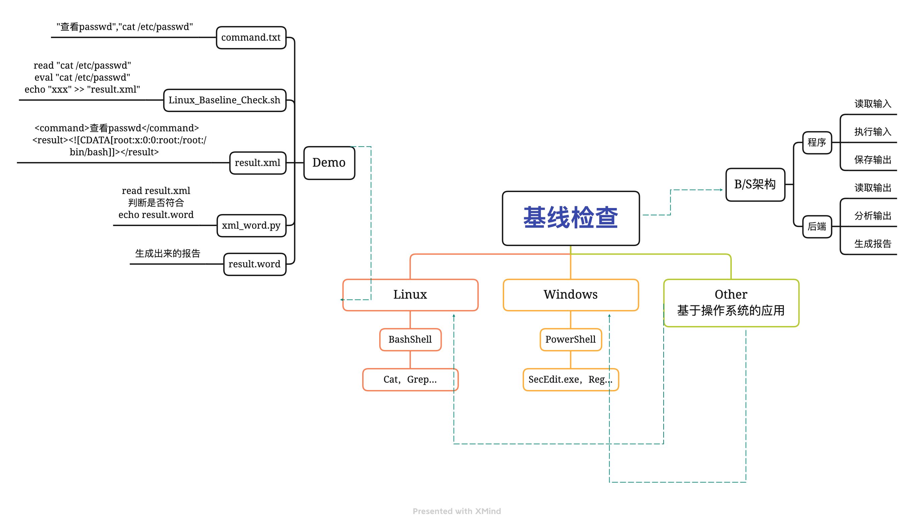
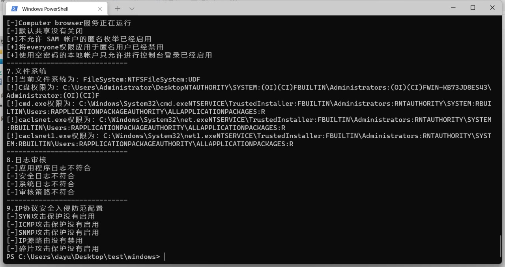
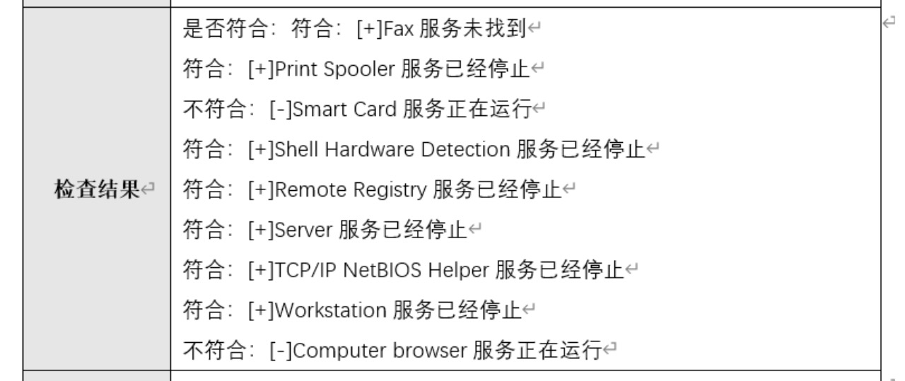

# 自动化基线检查

可以实现输出标准的docx模版检查结果，支持linux，windows。windows还支持加固。

整个实现非常简单

windows 直接调用自带的SecEdit.exe，即可输出某些设置，某些不全的地方再用注册表补全

linux 将命令的输出到xml的`<![CDATA[]]>`我也没有其他好的办法。

然后用python来解析输出，判断是否符合，再利用python的这个MailMerge库配合docx的那个啥来着，就能将结果写入到docx里面了。

windows的加固就是反过来，制作一份标准的config，然后用SecEdit.exe倒入即可，注册表也一样。

